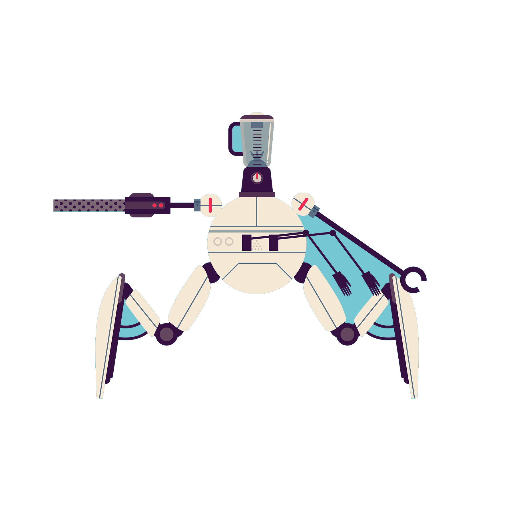

 
  <b>Profile Views</b> 
  

	

<h2> <strong> ⚙️ Technologies and Skills </strong></h2>
  

<h3> <strong> Languages, Frameworks, and Tools </strong></h3>

 
  
  
  
  
  
  
  
  
  
  
  
  
  
  

  

