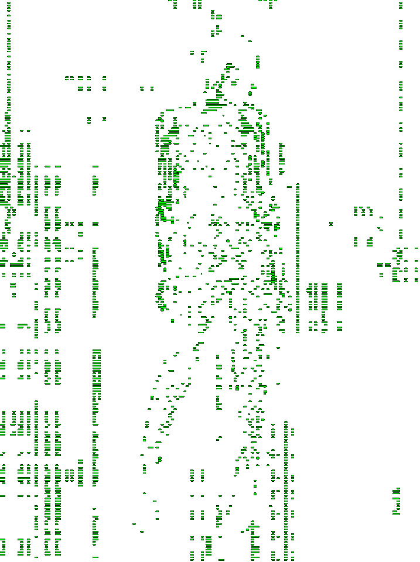

  

<h1>👋 Hi, I'm Edgar</h1>

  6+ years of commercial experience building stable, responsive, and maintainable interfaces.  
  I specialize in building stable, responsive, and maintainable interfaces using HTML, SCSS, semantic markup, design-to-code implementation, UI refactoring, and legacy product support.

  I work both on projects from scratch and within existing codebases. I also handle UI-focused frontend tasks with JavaScript, TypeScript, Vue.js, and Angular, including component updates, client-side logic, and interface behavior improvements.

<h3>💬 Contact Me</h3>

&nbsp;&nbsp;&nbsp;

&nbsp;&nbsp;&nbsp;

&nbsp;&nbsp;&nbsp;

<h4>Markup, Styling and UI Foundations</h4>

  
  
  
  
  
  
  
  
  

<h4>Frontend Frameworks and UI Libraries</h4>

  
  
  
  

<h4>Design, CMS and Daily Workflow</h4>

  
  
  
  
  

<h4>Package Managers and Build Tools</h4>

  
  
  
  
  
  
  

 

