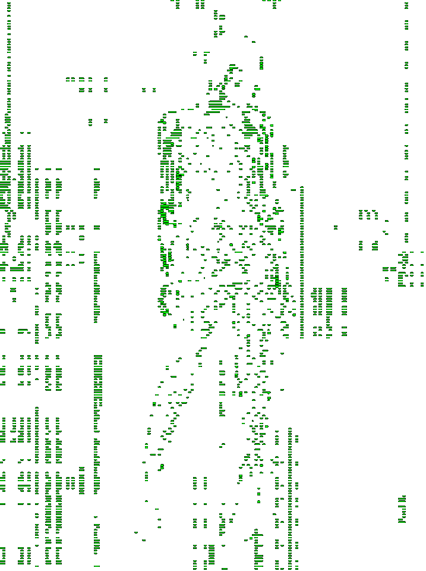

  
  <h4>
    🚀 I have 2.5 years of commercial experience. I specialize in the development of multi-page sites, landing pages, and individual pages for large projects. I have worked on tasks with adaptive, accessible, and cross-browser layout, using various technologies. 🌐
  </h4>

  <h3>👀 Profile Views</h3>
  

  <h3 align="center">📧 Contact Me</h3>
  
  

  
  
  
  
  

    <h2 align="center">🚀 Tech Stack</h2>
    
    

      

        <h3>🛠️ Languages, Frameworks, and Tools</h3>
        
        
        
        
        
         
        
        
        
        
        
        
      

       
      
       
       
      
    

  

  
  
  
  
  
  <h2>💼 Featured Projects</h2>
  

    
    
    
    
  

  
  
  
   

